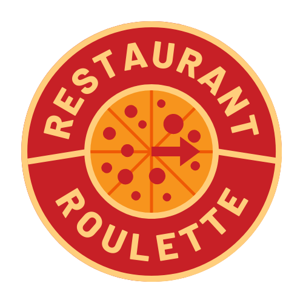

 # 
 # Restaurant Roulette

A full stack app that helps a user choose a restaurant when having a difficult time picking one. 

---

# About the Project
 # 
The user is able to make certain decisions about the type of restaurant they want to eat at. 
After entering the area, the user can choose the price and type of food. 

---

# How It's Made
React, Node.js, Express, and Tailwind CSS

---

# Contact Me

[Linkedin](https://www.linkedin.com/in/eherrera09/) 
 
[Portfolio](https://codingmypath.netlify.app/)

